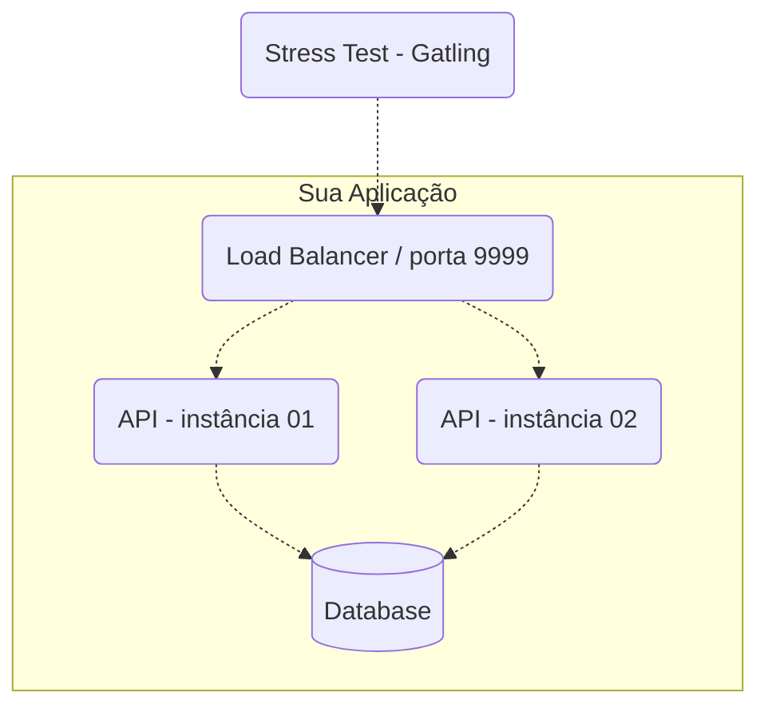

## Desafio

Para esse desafio será preciso desenvolver uma pequena API REST (duas rotas) escrita em Java, além de uma pequena aplicação frontend (duas rotas) escrita em Typescript/Javascript.
O desafio do backend é baseado na ["Rinha de backend 2024/1"](https://github.com/zanfranceschi/rinha-de-backend-2024-q1),
mas não idêntico (ao invés de crédito ('c'), usamos recebíveis ('r')). Fique à vontade para tomar por base alguma das implementações da rinha.
Não é preciso floreio, nem que o frontend fique bonito. Será observado se os requisitos foram ou não cumpridos.

## Desafio frontend

Feito o backend, será preciso criar uma aplicação em React e Typescript/Javascript, utilizando a biblioteca [MUI](https://mui.com/material-ui/), com duas rotas: `/transacoes` e `/extrato`.
Essas duas rotas estarão abertas em duas janelas/abas diferentes do navegador. O frontend deve rodar na porta 3000 como um serviço do docker compose.

### `/transacoes`

Na tela de transações, só será preciso um botão que gere uma chamada ao endpoint
`POST /clientes/[id]/transacoes` com um usuário já cadastrado pelo sql
de inicialização (`script.sql`). Os valores podem ser aleatórios. Retornada a resposta da requisição, será preciso comunicar a outra aba/janela da requisição feita, passando o id do usuário utilizado. Há mais de uma forma de passar essa mensagem para outras abas/janelas, escolhar qualquer uma.

### `/extrato`

Recebendo a mensagem da janela/aba `/transacoes`, deverá ser feita uma chamada ao endpoint
`GET /clientes/[id]/extrato` com o id utilizado, mostrando em tela o resultado.

## Desafio backend

No backend é preciso implementar duas rotas, descritas abaixo, e realizar o teste de carga com Gatling. Não é necessário garantir que a API não dê *timeout* em algumas requisições, mas só que as regras foram respeitadas.

### Transações

**Requisição**

`POST /clientes/[id]/transacoes`

```json
{
    "valor": 1000,
    "tipo" : "r",
    "descricao" : "descricao"
}
```

Onde

- `[id]` (na URL) deve ser um número inteiro representando a identificação do cliente.
- `valor` deve ser um número inteiro positivo que representa centavos (não vamos trabalhar com frações de centavos). Por exemplo, R$ 10 são 1000 centavos.
- `tipo` deve ser apenas `r` para recebível ou `d` para débito.
- `descricao` deve ser uma string de 1 a 10 caracteres.

Todos os campos são obrigatórios.

**Resposta**

`HTTP 200 OK`

```json
{
    "limite" : 100000,
    "saldo" : -9098
}
```

Onde

- `limite` deve ser o limite cadastrado do cliente.
- `saldo` deve ser o novo saldo após a conclusão da transação.

*Obrigatoriamente, o http status code de requisições para transações bem sucedidas deve ser 200!*

**Regras**
Uma transação de débito **nunca** pode deixar o saldo do cliente menor que seu limite disponível. Por exemplo, um cliente com limite de 1000 (R\$ 10) nunca deverá ter o saldo menor que -1000 (R\$ -10). Nesse caso, um saldo de -1001 ou menor significa inconsistência na Rinha de Backend!

Se uma requisição para débito for deixar o saldo inconsistente, a API deve retornar HTTP Status Code 422 sem completar a transação! O corpo da resposta nesse caso não será testado e você pode escolher como o representar. HTTP 422 também deve ser retornado caso os campos do payload estejam fora das especificações como, por exemplo, uma string maior do que 10 caracteres para o campo `descricao` ou algo diferente de `r` ou `d` para o campo `tipo`. Se para o campo `valor` um número não inteiro for especificado, você poderá retornar HTTP 422 ou 400.

Se o atributo `[id]` da URL for de uma identificação não existente de cliente, a API deve retornar HTTP Status Code 404. O corpo da resposta nesse caso não será testado e você pode escolher como o representar. Se a API retornar algo como HTTP 200 informando que o cliente não foi encontrado no corpo da resposta ou HTTP 204 sem corpo, ficarei extremamente deprimido e a Rinha será cancelada para sempre.

## Extrato

**Requisição**

`GET /clientes/[id]/extrato`

Onde

- `[id]` (na URL) deve ser um número inteiro representando a identificação do cliente.

**Resposta**

`HTTP 200 OK`

```json
{
  "saldo": {
    "total": -9098,
    "data_extrato": "2024-01-17T02:34:41.217753Z",
    "limite": 100000
  },
  "ultimas_transacoes": [
    {
      "valor": 10,
      "tipo": "r",
      "descricao": "descricao",
      "realizada_em": "2024-01-17T02:34:38.543030Z"
    },
    {
      "valor": 90000,
      "tipo": "d",
      "descricao": "descricao",
      "realizada_em": "2024-01-17T02:34:38.543030Z"
    }
  ]
}
```

Onde

- `saldo`
  - `total` deve ser o saldo total atual do cliente (não apenas das últimas transações seguintes exibidas).
  - `data_extrato` deve ser a data/hora da consulta do extrato.
  - `limite` deve ser o limite cadastrado do cliente.
- `ultimas_transacoes` é uma lista ordenada por data/hora das transações de forma decrescente contendo até as 10 últimas transações com o seguinte:
  - `valor` deve ser o valor da transação.
  - `tipo` deve ser `r` para recebível e `d` para débito.
  - `descricao` deve ser a descrição informada durante a transação.
  - `realizada_em` deve ser a data/hora da realização da transação.

**Regras**
Se o atributo `[id]` da URL for de uma identificação não existente de cliente, a API deve retornar HTTP Status Code 404. O corpo da resposta nesse caso não será testado e você pode escolher como o representar. Já sabe o que acontece se sua API retornar algo na faixa 2XX, né? Agradecido.

## Cadastro Inicial de Clientes

Para haver ênfase em concorrência durante o teste, poucos clientes devem ser cadastrados e testados. Por isso, apenas cinco clientes, com os seguintes IDs, limites e saldos iniciais, devem ser previamente cadastrados para o teste – isso é imprescindível!

| id | limite | saldo inicial
| - | - | -
| 1 | 100000 | 0
| 2 | 80000 | 0
| 3 | 1000000 | 0
| 4 | 10000000 | 0
| 5 | 500000 | 0

Obs.: Não cadastre um cliente com o ID 6 especificamente, pois parte do teste é verificar se o cliente com o ID 6 realmente não existe e a API retorna HTTP 404!

## Restrições

Você precisará conteinerizar sua API e outros componentes usados no formato de *docker-compose*, obedecer às restrições de recursos de CPU e memória, configuração mínima arquitetural.

### Arquitetura Mínima da API

Por "API" aqui, me refiro a todos os serviços envolvidos para que o serviço que atenderá às requisições HTTP funcione, tais como o load balancer, banco de dados e servidor HTTP.

A sua API precisa ter, no mínimo, os seguintes serviços:

- Um **load balancer** que faça a distribuição de tráfego usando o algoritmo round robin. Diferentemente da edição anterior, você não precisa usar o Nginx – pode escolher (ou até fazer) qualquer um como p.ex. o HAProxy. **O load balancer será o serviço que receberá as requisições do teste e ele precisa aceitar requisições na porta 9999**!
- **2 instâncias de servidores web** que atenderão às requisições HTTP (distribuídas pelo load balancer).
- Um banco de dados relacional ou não relacional (exceto bancos de dados que têm como principal característica o armazenamento de dados em memória, tal como Redis, por exemplo).



**Nota**: Você pode usar componentes adicionais se quiser. Mas lembre-se de que as restrições de CPU e memória devem obedecer a regra de que a soma dos limites (que devem ser declarados para todos os serviços) não poderá ultrapassar 1.5 unidades de CPU e 550MB de memória! Use o bom senso e boa fé, não adicione um banco relacional e um Redis, por exemplo, e use apenas o Redis como armazenamento – afinal, a Rinha é apenas uma brincadeira que fomenta o aprendizado e não a competição desleal.

### Restrições de CPU/Memória

Dentro do seu arquivo docker-compose.yml, você deverá limitar todos os serviços para que a soma deles não ultrapasse os seguintes limites:

- `deploy.resources.limits.cpu` 1.5 – uma unidade e meia de CPU distribuída entre todos os seus serviços
- `deploy.resources.limits.memory` 550MB – 550 mega bytes de memória distribuídos entre todos os seus serviços

Obs.: Por favor, use `MB` para unidade de medida de memória; isso facilita as verificações de restrições.

```yml
# exemplo de parte de configuração de um serviço dentro do um arquivo docker-compose.yml
...
  nginx:
    image: nginx:latest
    volumes:
      - ./nginx.conf:/etc/nginx/nginx.conf:ro
    depends_on:
      - api01
      - api02
    ports:
      - "9999:9999"
    deploy:
      resources:
        limits:
          cpus: "0.17"
          memory: "10MB"
...
```

### Arquivos de exemplo para te ajudar

O seguinte são apenas arquivos de exemplo para que você não saia do zero, caso tenha alguma dificuldade ou apenas queira acelerar a construção da sua API. Obviamente, modifique como quiser respeitando todos as restrições anteriormente explicadas aqui. Novamente, você não precisa usar especificamente um banco de dados relacional – o exemplo seguinte é apenas ilustrativo.

`docker-compose.yml`

```yml
services:
  api01: &api
    image: ana/minha-api-matadora:latest 
    # ou no modelo local:
   # build:
   #   context: ./
   #   dockerfile: ./Dockerfile
    hostname: api01
    environment:
      - DB_HOSTNAME=db
    
    # Não é necessário expor qualquer porta além da porta do load balancer,
    # mas é comum as pessoas o fazerem para testarem suas APIs e conectarem
    # ao banco de dados na fase de desenvolvimento.
    ports:
      - "8081:8080"
    depends_on:
      - db
    deploy:
      resources:
        limits:
          cpus: "0.6"
          memory: "200MB"

  api02:
    # Essa sintaxe reusa o que foi declarado em 'api01'.
    <<: *api 
    hostname: api02
    environment:
      - DB_HOSTNAME=db
    ports:
      - "8082:8080"
 
  nginx:
    image: nginx:latest
    volumes:
      - ./nginx.conf:/etc/nginx/nginx.conf:ro
    depends_on:
      - api01
      - api02
    ports:
        # Obrigatório expor/usar a porta 9999 no load balancer!
      - "9999:9999" 
    deploy:
      resources:
        limits:
          cpus: "0.17"
          memory: "10MB"

  db:
    image: postgres:latest
    hostname: db
    environment:
      - POSTGRES_PASSWORD=123
      - POSTGRES_USER=admin
      - POSTGRES_DB=rinha
    ports:
      - "5432:5432"
    volumes:
      - ./script.sql:/docker-entrypoint-initdb.d/script.sql
    deploy:
      resources:
        limits:
          # Note que a soma de todos os limites dos serviços
          # aqui declarados é de 1.5 unidades de CPU e 550MB
          # de memória. A distribuição feita aqui é apenas
          # um exemplo – distribua como quiser.
          cpus: "0.13"
          memory: "140MB"

# O uso do modo `bridge` deve ser adequado à carga que será usada no teste.
# A edição anterior se beneficiou do modo host pois o volume de requisições
# era relativamente alto e a virtualização da rede se tornou um gargalo, mas
# este modo é mais complexo de ser configurado. Fique à vontade para usar o
# modo que quiser desde que não conflite com portas trivialmente usadas em um
# SO.
networks:
  default:
    driver: bridge
    name: rinha-nginx-2024q1

```

`script.sql`

```sql
-- Coloque scripts iniciais aqui
CREATE TABLE...

DO $$
BEGIN
  INSERT INTO clientes (nome, limite)
  VALUES
    ('o barato sai caro', 1000 * 100),
    ('zan corp ltda', 800 * 100),
    ('les cruders', 10000 * 100),
    ('padaria joia de cocaia', 100000 * 100),
    ('kid mais', 5000 * 100);
END; $$
```

`nginx.conf`

```config
events {
    worker_connections 1000;
}

http {
    access_log off;
    sendfile   on;
    
    upstream api {
        server api01:8080;
        server api02:8080;
    }

    server {
        listen 9999; # Lembra da porta 9999 obrigatória?
        
        location / {
            proxy_pass http://api;
        }
    }
}

```

## Ferramenta de Teste

A ferramenta Gatling será usada para realizar o teste de performance. Pode fazer muita diferença você executar os testes durante a fase de desenvolvimento para detectar possíveis problemas e gargalos. O teste está disponível nesse repositório em [load-test](./load-test).

## Ambiente de Testes

Note que o ambiente em que os testes serão executados é Linux x64. Portanto, se seu ambiente de desenvolvimento possui outra arquitetura, você precisará fazer o build do docker da seguinte forma:
`$ docker buildx build --platform linux/amd64`

Por exemplo:
`$ docker buildx build --platform linux/amd64 -t ana/minha-api-matadora:latest .`

### Para executar os testes

Aqui estão instruções rápidas para você poder executar os testes:

1. Baixe o Gatling em https://gatling.io/open-source/
1. Certifique-se de que tenha o JDK instalado
    (64bits OpenJDK LTS (Long Term Support) versions: 11, 17 e 21)
    https://gatling.io/docs/gatling/tutorials/installation/
1. Certifique-se de configurar a variável de ambiente GATLING_HOME para o diretório da instalação do Gatling.
    Para se certificar de que a variável está correta, os seguinte caminhos precisam ser válidos:
      `$GATLING_HOME/bin/gatling.sh` no Linux e `%GATLING_HOME%\bin\gatling.bat` no Windows.
1. Configure o script `./executar-teste-local.sh` (ou `./executar-teste-local.ps1` se estiver no Windows)
1. Suba sua API (ou load balancer) na porta 9999
1. Execute `./executar-teste-local.sh` (ou `./executar-teste-local.ps1` se estiver no Windows)
1. Agora é só aguardar o teste terminar e abrir o relatório
    O caminho do relatório é exibido ao término da simulação.
    Os resultados/relatórios são salvos em `./load-test/user-files/results`.

De nada :)

## Licença

Esse desafio é baseado na rinha de backend (https://github.com/zanfranceschi/rinha-de-backend-2024-q1), licença MIT:

MIT License

Copyright (c) 2024 Francisco Zanfranceschi

Permission is hereby granted, free of charge, to any person obtaining a copy
of this software and associated documentation files (the "Software"), to deal
in the Software without restriction, including without limitation the rights
to use, copy, modify, merge, publish, distribute, sublicense, and/or sell
copies of the Software, and to permit persons to whom the Software is
furnished to do so, subject to the following conditions:

The above copyright notice and this permission notice shall be included in all
copies or substantial portions of the Software.

THE SOFTWARE IS PROVIDED "AS IS", WITHOUT WARRANTY OF ANY KIND, EXPRESS OR
IMPLIED, INCLUDING BUT NOT LIMITED TO THE WARRANTIES OF MERCHANTABILITY,
FITNESS FOR A PARTICULAR PURPOSE AND NONINFRINGEMENT. IN NO EVENT SHALL THE
AUTHORS OR COPYRIGHT HOLDERS BE LIABLE FOR ANY CLAIM, DAMAGES OR OTHER
LIABILITY, WHETHER IN AN ACTION OF CONTRACT, TORT OR OTHERWISE, ARISING FROM,
OUT OF OR IN CONNECTION WITH THE SOFTWARE OR THE USE OR OTHER DEALINGS IN THE
SOFTWARE.
